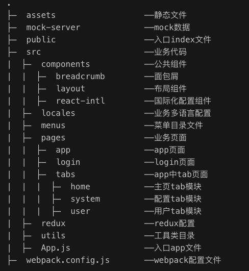

# antd + react + redux + webpack4 + router4基础框架

#### antd-react-redux-saga-router4-webpack4-react-intl3

---

## 说明

antd + react + redux + webpack4 + router4基础框架，结合antd的UI框架，实现主题定制，使用最新版本的react16.9，webpack4和react-router4实现按需加载

功能说明：
1.动态路由
2.菜单配置
3.数据管理
4.按需加载
5.权限控制
6.国际化语言
7.本地mock服务
8.路径alias别名
9.安全CSRF防范

## 安装

```bash
$ npm i

```
## 运行

```bash
$ npm start
```
or
```bash
$ npm run dev
```
## 打包

```bash
$ npm run build:test
```
or
```bash
$ npm run build:prod
```

## 结构说明



### 1.语法规范说明
 1.针对tabs业务模块，不再使用文件名称代表某个业务模块，建议使用目录名称替代。比如主页模块，目录名称home就代表home业务模块，home目录下采用index.js作为模块入口

 2.由于react已经采用react16.9版本，切勿继续使用componentWillMount和componentWillReceiveProps等即将要废弃的生命周期，免得要在react17版本中增加维护成本 

 ... 

### 2.menus-新增菜单配置说明
 新增一个菜单需要两个步骤： 

 1.在menus中的index.js文件中添加新菜单，其中key和path都是唯一值 

 2.在对应的tabs模块下添加index.menux.js文件配置，其中key和path要与步骤1中保持一致 

### 3.react-intl国际化多语言说明
 国际化使用react-intl，有两种场景： 

 1.dom场景：直接生成HTML对应的翻译文本dom，如home模块 

 2.字符串场景：直接生成string字符串翻译文本字符串，如user模块 


### 4.redux使用说明
 redux配置参考了dva的部分设计思想： 
> 1.需要使用redux的业务模块需要在对应目录下新建index.model.js文件，以及在对应的index.js文件中引入connect

> 2.model中的name需要保持唯一，它是挂在store下state对应的key值

> 3.reducers和effects函数的key，最好以步骤2中的name开头，调用时业务清晰明了，同时方便后期全局的搜索和维护

---

 redux建议使用场景 
> 1.兄弟组件之间通信，不建议在直接父子组件中滥用redux

> 2.跨多层父子组件之间通信，比如爷爷和孙子，曾祖父和曾孙等。redux原理之一就是基于这个来做的。

>>理论上，在index.js中直接使用axios处理异步已满足百分之九十业务场景了，比如user模块； 

>>只有一些跨兄弟组件通信或者跨多层父子组件才需要使用redux，比如login模块；

>>home模块中的示例只是为了方便介绍redux的使用方法，故意而为之

### 5.mock使用说明
 使用cf-mock-server插件，在mock-server中配置对应的mock-data数据json文件即可 


